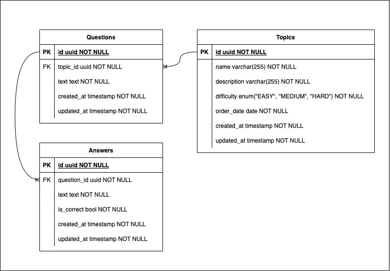

# Topic Trainer

Topic Trainer is a web application designed to help users test and enhance their knowledge on various topics. Whether you're a beginner or an expert, you can choose from a range of subjects and test your understanding through interactive quizzes.

## Features

- Choose from a variety of topics, including Python Fundamentals, Python Web Advanced, OOP JavaScript, and more.
- Engage in interactive quizzes that challenge your knowledge.
- Receive immediate feedback on your answers.

## Table of Contents

- [Installation](#installation)


## Database Schema

Database schemas is designed as follows:

* A table for topics, each topic has a name, description and difficulty level (EASY, MEDIUM, HARD).
* A table for questions, each question has a text and a foreign key to the topic it belongs to.
* A table for answers, each answer has a text, a boolean value to indicate if it is correct and a foreign key to the question it belongs to.



## Installation

To run Topic Trainer locally on your machine, follow these steps:

1. Clone the repository:

   ```shell
   git clone https://github.com/yourusername/topic-trainer.git
   ```

2. Navigate to the `TopicTrainer` directory:

   ```shell
    cd TopicTrainer
    ```
   
3. Set up the environment, for the nginx reverse proxy we use
a local domain that must be set in the hosts file, this will add
the host 'flask.test' to the hosts file, works on linux and macos,
next, it will create an environment file from the .env.example file
   
   ```shell
   make setup
   ```

4. Review the environment file and make any changes as needed
**ENV** and **DEBUG** change how the application is built
and run respectively, the default is development, which will run the application
with the flask development server and will load the changes in real time.

   ```shell
   vim .env
   ```

5. Start the application

   ```shell
   make start
   ```
   
6. To run migrations on the database:
    
   ```shell
   make migrate
   ```
   
7. Open your browser and navigate to [**Topic Trainer**](http://flask.test)

## Additional Commands

- `make stop` - Stop the application
- `make restart` - Restart the application (rebuilds the containers)
- `make clean` - Remove all containers, images, volumes, networks and cache (use with caution)
- `make install-local` - Install the dependencies locally (useful for IDEs)

**Development**

- `make logs` - View the application logs
- `make lint` - Run the linter
- `make shell` - Open a shell in the application container
- `make playground` - Runs the playground file (experiments/playground.py)
to test new features conveniently

**Database**

- `make generate-migration` - Asks for a name and generates a migration file
- `make migrate` - Run migrations on the database
- `make rollback` - Rollback previous migration on the database
- `make clean-database` - Removes mapped database files (use with caution)
